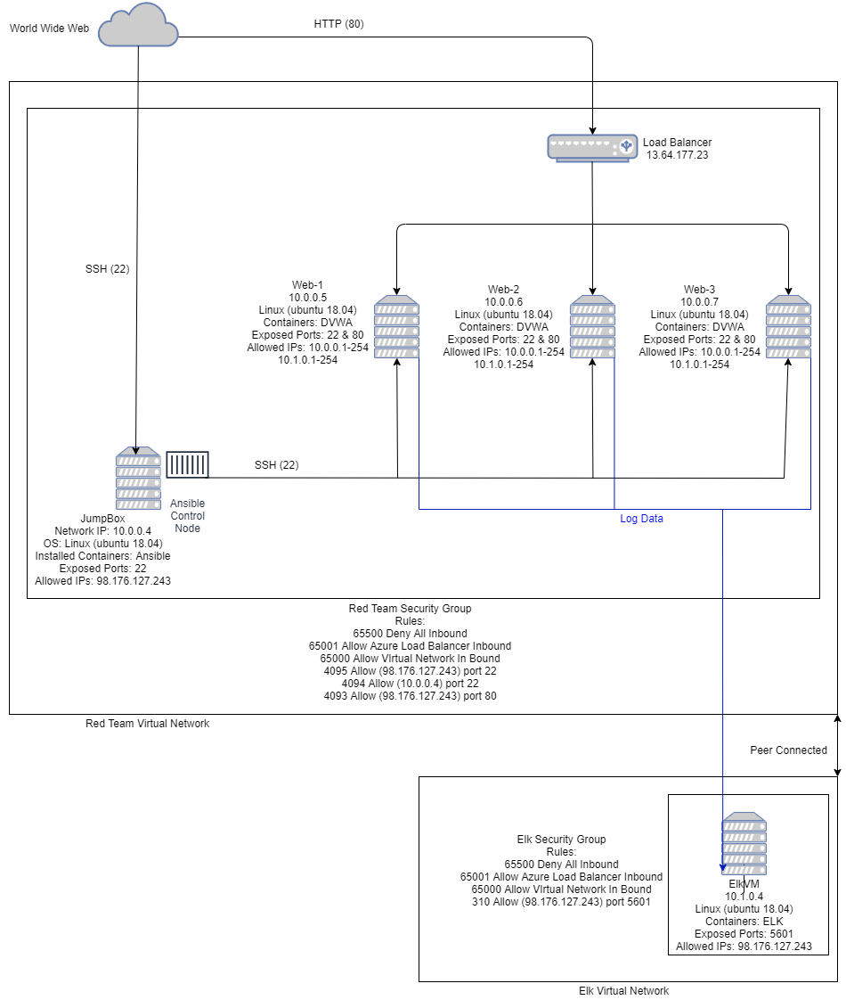

## Automated ELK Stack Deployment

The files in this repository were used to configure the network depicted below.



These files have been tested and used to generate an ELK deployment on Azure. They can be used to recreate the entire deployment pictured above.

This document contains the following details:
- Description of the Topology
- Access Policies
- ELK Configuration
  - Beats in Use
  - Machines Being Monitored
- How to Use the Ansible Build


## Description of the Topology

The main purpose of this network is to expose a load-balanced and monitored instance of **DVWA**, the "D*mn Vulnerable Web Application."

Load balancing ensures that the application will be highly available, in addition to restricting inbound access to the network. The load balancer ensures that incoming traffic will be shared by both vulnerable web servers. Access controls will ensure that only authorized users --- namely, ourselves --- will be able to connect in the first place.

Integrating an ELK server allows users to easily monitor the vulnerable VMs for changes to the file systems of the VMs on the network. As well as watch system metrics, such as CPU usage, attempted SSH logins, ```sudo``` escalation failures, etc.

The configuration details of each machine may be found below.

| Name    | Function  | IP Address | Operating System |
|---------|-----------|------------|------------------|
| JumpBox | Gateway   | 10.0.0.4   | Linux            |
| Web-1   | Run DVWA  | 10.0.0.5   | Linux            |
| Web-2   | Run DVWA  | 10.0.0.6   | Linux            |
| Web-3   | Run DVWA  | 10.0.0.7   | Linux            |
| ElkVM   | ELK Stack | 10.1.0.4   | Linux            |

In addition to the above, Azure has provisioned a load balancer in front of the Web Servers in one Availability Zone.

## Access Policies

The machines on the internal network are not exposed to the public Internet.

Only the JumpBox and ELK machines can accept connections from the Internet. Access to these machines is only allowed from the following IP addresses: 98.176.127.243

Machines within the network can only be accessed by each other.

A summary of the access policies in place can be found in the table below.

| Name     | Publicly Accessible | Allowed IP Addresses                         | Allowed Ports |
|----------|---------------------|----------------------------------------------|---------------|
| Jump Box |         Yes         |                98.176.127.243                |       22      |
| Elk      |         Yes         | 10.0.0.1-254 , 10.1.0.1-254 & 98.176.127.243 |      5601     |
| Web-1    |          No         |          10.0.0.1-254 & 10.1.0.1-254         |               |
| Web-2    |          No         |          10.0.0.1-254 & 10.1.0.1-254         |               |
| Web-3    |          No         |          10.0.0.1-254 & 10.1.0.1-254         |               |

## Elk Configuration

Ansible was used to automate configuration of the ELK machine. No configuration was performed manually, which is advantageous because it saves time and allows us to deploy more systems with the exact same settings in a matter of minutes.

The playbooks implement the following tasks:

### pentest.yml

- Directs **Ansible** to work with VMs under [webservers] in the `/etc/ansible/hosts` file.
- Install **Docker.io** and **Python3**
- Install Python Docker module
- Download and launch DVWA
- Enable **Docker** service

### install-elk.yml

- Directs **Ansible** to work with VMs under [elk] in the `/etc/ansible/hosts` file
- Install **Docker.io** and **Python3**
- Install Python Docker module
- Increase the machine's memory to the value `262144`
- Download and launch **ELK**

### filebeat-playbook.yml

- Downloads and installs **Filebeat** to [webservers]
- Copyies `/etc/ansible/files/filebeat-config.yml` to target machine's **Filebeat** configuration file
- Enable, configure and setup **Filebeat**
- Start **Filebeat**

### metricbeat-playbook.yml

- Downloads and installs **Metricbeat** to [webservers]
- Copyies `/etc/ansible/files/metricbeat-config.yml` to target machine's **Metricbeat** configuration file
- Enable, configure and setup **Metricbeat**
- Start **Metricbeat**

The following screentshot displays the result of running `docker ps` after successfully configuring the ELK instance.

(Images/dockerps.png)

### Target Machines & Beats
This ELK server is configured to monitor the following machines:
- 10.0.0.5
- 10.0.0.6
- 10.0.0.7

We have installed the following beats on these machines:
- Filebeat
- Metricbeat

These Beats allow us to collect the following information from each machine:
- **Filebeat**: Filebeat detects changes to the filesystem. Specifically, we use it to collect Apache logs.
- **Metricbeat**: Metricbeat detects changes in system metrics, such as CPU usage. We use it to detect SSH login attempts,, failed `sudo` escalations, and CPU/RAM statistics.

## Using the Playbooks
In order to use the playbooks, you will need to have an Ansible control node already configured. Assuming you have such a control node provisioned:

SSH into the control node and follow the steps below:
- Copy the playbook files to the Ansible Control Node
- Run each playbook on the appropriate targets

The easiest way to copy the playbooks is to use Git:
``` bash
$ cd /etc/ansible
$ mkdir files
# Clone Repository + IaC Files
$ git clone https://github.com/ssnyder90/Cybersecurity.git
# Move Playbooks and config files into into `/etc/ansible`
$ cp Cybersecurity/Ansible/Playbooks/* /etc/ansible/roles
$ cp Cybersecurity/Ansible/Files/* /etc/ansible/files
```

This copies the playbook files to the correct place.

Next you must create a 'hosts' file to specify which VMs to run each playbook on. Run the commands below:

```bash
$ cd /etc/ansible
$ nano hosts
# Add [webservers] and [elk] and their respective IPs
[webservers]
10.0.0.5 ansible_python_interpreter=/usr/bin/python3
10.0.0.6 ansible_python_interpreter=/usr/bin/python3
10.0.0.7 ansible_python_interpreter=/usr/bin/python3

[elk]
10.1.0.4 ansible_python_interpreter=/usr/bin/python3
```

After this, the commands below run the playbook:

```bash
$ cd /etc/ansible/roles
$ ansible-playbook install-elk.yml
$ ansible-playbook filebeat-playbook.yml
$ ansible-playbook metricbeat-playbook.yml
